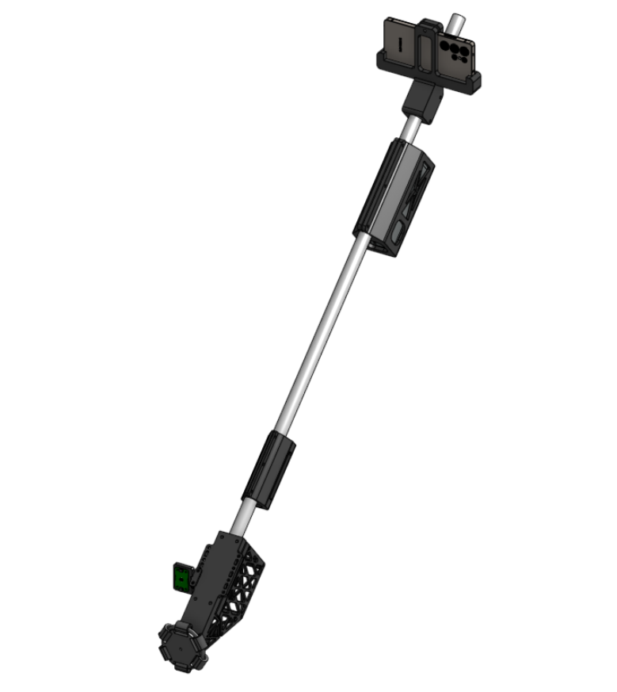

# Lighthouse

**An open-source self-steering white cane. Every AI model runs on Qualcomm
silicon, on the device, offline.**

Lighthouse guides a person with impaired vision by *physically steering them*. A
3D-printed omni wheel at the cane tip applies a lateral nudge — left or right —
around obstacles and along a walking route. Metric depth estimation, semantic
segmentation, and object detection all run on a Snapdragon 8 Elite's Hexagon NPU
and Adreno GPU. Obstacle avoidance never touches the network.



Built for the **Snapdragon Multiverse Hackathon 2026** · Qualcomm San Diego

**At a glance**

| | |
|---|---|
| **No depth sensor** | Monocular metric depth on the NPU replaces the LiDAR this approach normally needs — the single largest cost in the published research design |
| **~$196 in parts** | Excluding the phone. Commercial smart canes: $800–$1,150 |
| **Fully offline steering** | Airplane mode changes nothing about obstacle avoidance |
| **~11 Hz perception, 5 Hz steering** | Three neural networks per frame on a phone, with headroom |
| **Open source end to end** | Code, CAD, BOM, and wiring — AGPL-3.0 |

---

## Team

| Name | Email |
|---|---|
| _TODO: replace before submitting_ | _TODO_ |
| _TODO_ | _TODO_ |

> **Pre-submission checklist — delete this block before you submit.**
> - [ ] Team table filled in (names + emails are a hard requirement)
> - [ ] Every member has submitted the feedback form
> - [ ] Repo pushed to a **personal** GitHub account, verified public
> - [ ] Repo link submitted via the Microsoft Form by **12:00 PM, Friday Aug 7**

---

## Contents

- [The problem](#the-problem)
- [Our approach](#our-approach)
  - [What the research established](#what-the-research-established)
  - [What we changed: LiDAR to NPU](#what-we-changed-lidar-to-npu)
  - [Capabilities](#capabilities)
- [Edge AI on the Qualcomm stack](#edge-ai-on-the-qualcomm-stack)
  - [Three networks per frame, on a phone](#three-networks-per-frame-on-a-phone)
  - [Accelerator strategy](#accelerator-strategy)
  - [Why the GPU gets vision and the NPU gets language](#why-the-gpu-gets-vision-and-the-npu-gets-language)
  - [What we measured on-device](#what-we-measured-on-device)
  - [Qualcomm tooling used](#qualcomm-tooling-used)
- [How it works](#how-it-works)
  - [System architecture](#system-architecture)
  - [The sensing and steering loop](#the-sensing-and-steering-loop)
  - [Design deep-dive: path-first planning](#design-deep-dive-path-first-planning)
- [Hardware](#hardware)
  - [Printed parts](#printed-parts)
  - [Cost](#cost)
- [Accessibility by design](#accessibility-by-design)
- [Getting started](#getting-started)
- [Repository layout](#repository-layout)
- [Performance](#performance)
- [Safety](#safety)
- [Roadmap](#roadmap)
- [Troubleshooting](#troubleshooting)
- [Contributing](#contributing)
- [Prior work and acknowledgments](#prior-work-and-acknowledgments)
- [License](#license)

---

## The problem

Roughly **250 million people** worldwide live with impaired vision. Walking an
unfamiliar route means solving several problems simultaneously — detecting
obstacles, identifying them, and wayfinding both indoors and out. Existing tools
each solve part of it, and the effective ones are priced beyond reach of most
people who need them.

| Aid | Typical cost | Limitation |
|---|---|---|
| White cane | ~$20 | Contact sensing only, no wayfinding |
| Sensor smart canes | $800 – $1,150 | Usually report obstacles rather than steer |
| AI wearables | $2,000 – $5,000 | Often cloud-dependent; latency and privacy cost |
| Guide dog | ~$50,000 | Multi-year waitlist; not viable at scale |

Most people with impaired vision live in low- and middle-income countries, where
any of those can exceed an annual income.

Price isn't the only barrier. Most electronic travel aids **report** — a beep, a
buzz, a spoken phrase — and leave you to interpret it. Interpretation costs time
and attention exactly when you have least of both. Cloud-dependent devices add
seconds of round-trip latency on top, which is untenable when the obstacle is
moving or you're approaching a crossing. Latency here is a safety property, and
that is the argument for edge inference.

## Our approach

Lighthouse **steers** instead of reporting. The wheel tugs your hand toward the
clear path; you keep walking and the cane resolves the geometry.

### What the research established

The steering principle comes from published work on augmented white canes:

> P. Slade, A. Tambe, M. J. Kochenderfer, **"Multimodal sensing and intuitive
> steering assistance improve navigation and mobility for people with impaired
> vision,"** *Science Robotics* **6**(59), eabg6594 (2021).
> [doi:10.1126/scirobotics.abg6594](https://doi.org/10.1126/scirobotics.abg6594)
> · [open-source reference design](https://github.com/pslade2/AugmentedCane)

That study compared a cane with a motorized omni wheel against a plain white
cane, across four navigation tasks, with both blindfolded sighted participants
and participants with impaired vision. Two findings drove our design.

**Grounded kinesthetic feedback wins.** Steering the hand through the cane
directed people more accurately and with measurably lower cognitive load than
vibrotactile or audio cues — participants began turning sooner when steered than
when buzzed.

**Walking speed rose** 18 ± 7% for participants with impaired vision and 35 ± 12%
for blindfolded sighted participants, versus a white cane. The authors attribute
this to accurate steering, reduced cognitive load, fewer environmental contacts,
and greater confidence.

Those numbers describe *their* device. They are why we chose a steering actuator
over a haptic one — not a claim about this implementation, which has not been
evaluated with users.

### What we changed: LiDAR to NPU

The published design senses with 2D LiDAR plus GPS and an IMU, computing in the
handle. **Lighthouse replaces all of that with a phone.** The Galaxy S25 Ultra
supplies camera, GPS, compass, and gravity vector, and the Snapdragon 8 Elite
runs monocular metric depth and semantic segmentation where the reference
prototype needed a laser scanner.

| | Reference design (2021) | Lighthouse |
|---|---|---|
| Range sensing | 2D LiDAR | **Monocular metric depth on Hexagon NPU** |
| Scene understanding | Object recognition | **Semantic walkability segmentation**, domain-matched |
| Compute | Onboard, in the handle | **Snapdragon 8 Elite** — NPU + GPU + CPU |
| Obstacle memory | Per-scan | **Persistent BEV log-odds grid** |
| Route following | GPS waypoints | Walking route, 12 m look-ahead, auto-reroute |
| Omni wheel | Machined hub adapter | **Print-in-place, no bearings or adapter** |
| Cost of range sensing | LiDAR unit | **$0** — camera the user already owns |
| Total | ~$400 | **~$196** |

Eliminating the laser scanner is the central engineering claim, and it is only
possible because the NPU makes per-pixel metric depth cheap enough to run
continuously on a battery.

### Capabilities

- **Physical steering** — lateral force via the tip wheel. Forward rolling is
  unimpeded, so the cane never drags.
- **Monocular metric depth** — per-pixel distance in meters from one RGB camera,
  on the NPU. No depth sensor, no stereo rig.
- **Persistent bird's-eye map** — obstacles accumulate as log-odds evidence in a
  61×60 grid at 0.1 m, so a single bad frame can't flip a decision.
- **Path-first planning** — the route owns the heading; off-path obstacles are
  ignored outright rather than perturbing your course.
- **Indoor and outdoor modes** — walking routes outdoors, compass bearing indoors,
  each with its own domain-matched model pair.
- **Self-calibrating ground plane** — the grid estimates its own ground offset, so
  mount error corrects itself instead of reading the floor as a wall.
- **Near-field tip sensing** — a time-of-flight sensor catches what the camera
  can't see and triggers a stop.
- **On-device speech** — neural TTS for alerts; recognition never leaves the phone.
- **Optional offline companion** — a 2B-parameter language model on the NPU
  answers questions about the scene. Off by default; see [Roadmap](#roadmap).
- **Reads text on request** — signs, labels, menus, via on-device OCR.

## Edge AI on the Qualcomm stack

This is the part of the project we'd point a judge at first.

### Three networks per frame, on a phone

| Model | Role | Cadence | Runtime |
|---|---|---|---|
| **Depth-Anything-V2-Metric-Small** | Per-pixel metric depth | ~3 Hz | ONNX Runtime + **QNN EP** |
| **FFNet-78S-LowRes** (Cityscapes) | Walkability, **outdoor** | per frame, inline | QNN EP → **Hexagon NPU** |
| **SegFormer-B0** (ADE20K) | Walkability, **indoor** | per frame, async | QNN EP → **Hexagon NPU** |
| **YOLOv8n** | Object labels, depth-scale calibration | 1 Hz | QNN EP |
| **Qwen3.5-2B** (Q4_0) | Optional scene companion | on request | **GenieX** → NPU |
| **Supertonic 3 / Kokoro-82M** | Neural speech | on utterance | sherpa-onnx, CPU |

Two of these are indoor/outdoor alternates, so a given frame runs depth +
one segmentation model, with detection every tenth frame.

### Accelerator strategy

QNN is configured for the 8 Elite specifically — `soc_model=69`, `htp_arch=79`,
burst performance mode, fp16 — and falls back through three tiers:

```
strict  →  every op on the NPU; fastest, fails if one op is unsupported
mixed   →  NPU where possible, CPU for the remainder
CPU     →  always works
```

A model that can't fully compile still runs rather than crashing. The manifest
declares `libcdsprpc.so` (FastRPC to the Hexagon DSP) and `libOpenCL.so` (Adreno)
via `<uses-native-library>` — since API 31 the linker blocks undeclared vendor
libraries, and omitting them silently drops you to CPU.

**Segmentation is domain-matched, not ensembled.** An earlier version ran both
experts every frame and merged their votes. Selecting one per navigation mode
**halves segmentation compute** for no measurable loss — each model is already
specialized for its domain, and merging mostly averaged away that specialization.

### Why the GPU gets vision and the NPU gets language

Counterintuitive, and it's the allocation decision we'd most want to explain.

Vision prefers the **Adreno GPU first**, NPU second. Not because the GPU is
faster in isolation — it isn't — but because the optional language model decodes
on the Hexagon NPU, and contending for the NPU stalls the steering loop. Steering
is safety-critical and must be predictable; a conversational reply can wait 200 ms
longer. Reserving the NPU for the SLM and giving vision the GPU keeps the
critical path deterministic.

This is the kind of tradeoff that only shows up once you're running multiple
models concurrently on one SoC, and it's why "put everything on the NPU" is the
wrong instinct.

### What we measured on-device

**Companion language model** — `GenieBench`, S25 Ultra, Qwen3.5-2B Q4_0, Hexagon:

| Metric | Value |
|---|---|
| First token | **186 ms** |
| Decode | **12.1 tok/s** |

**Depth on the board's CPU** — UNO Q, 4×A53 @ 2 GHz, 3 threads. This is the
experiment that decided where depth runs:

| Model | Input | Median | FPS |
|---|---|---|---|
| MiDaS float | 256×256 | 864 ms | 1.16 |
| MiDaS **w8a8** | 256×256 | **1001 ms** | 1.00 |
| Depth-Anything-V2-Small | 126×126 | 452 ms | 2.21 |
| Depth-Anything-V2-Small | 252×252 | 1728 ms | 0.58 |
| Depth-Anything-V2-Small | 378×378 | 4172 ms | 0.24 |

Two conclusions. Depth on a CPU-only A53 is not viable for steering — the fastest
config is 452 ms at a resolution too coarse to find a corridor, and cost scales
sharply with input size.

And **int8 quantization made MiDaS slower** (1001 ms vs 864 ms). With no NPU to
consume the quantized graph you pay dequantization overhead for nothing.
Quantization is a win only when an accelerator wants it — which is precisely the
argument for the Hexagon NPU on the phone, and why the perception stack lives
there rather than on the board.

### Qualcomm tooling used

| Tool | Use |
|---|---|
| **QNN / QAIRT Execution Provider** | All vision inference; three-tier fallback |
| **Qualcomm AI Hub** | Sourced and compiled FFNet-78S and SegFormer-B0 |
| **GenieX** | On-device LLM runtime for the companion model |
| **QUAD MCP** | Profiling on real silicon — `profile_device_plan` / `_report` over ADB |
| **Hexagon NPU** | Segmentation, depth, SLM decode |
| **Adreno GPU** | Vision inference (preferred tier), via OpenCL |
| **Arduino UNO Q** (Dragonwing QRB2210) | Cane board — actuation and near-field sensing |

## How it works

### System architecture

```
Galaxy S25 Ultra — Snapdragon 8 Elite
  │
  ├─ CameraX  ~11 Hz
  │    YUV → gravity-upright rotate → 640×640 letterbox
  │      ├─ YOLOv8n            @1 Hz    QNN    object labels, depth-scale calibration
  │      ├─ Depth-Anything-V2  @~3 Hz   QNN    metric depth, meters
  │      └─ Walkability seg    per-mode  NPU   FFNet-78S outdoor · SegFormer-B0 indoor
  │            │
  │            └─ TraversabilityGrid   61 × 60 cells @ 0.1 m   (±3.05 m × 6 m ahead)
  │                 ground-plane projection · log-odds evidence · ground self-calibration
  │                   │
  │                   └─ PolarPlanner   37 sectors across ±90°
  │                        DEFAULT: the route owns the heading
  │                        AVOID:   engages only when the goal cone is blocked
  │                          │
  │                          └─ CommandAggregator   200 ms weighted vote → one letter
  │
  ├─ Sensors     gravity vector → camera pitch / roll  (grid tilt correction)
  ├─ CompassNav  GPS + rotation vector → goal bearing
  │                outdoor: walking route, 12 m look-ahead · indoor: direct bearing
  │
  └─ BLE  ──▶  Arduino UNO Q — Dragonwing QRB2210
                 Modulino Motors   → JGA25 + omni wheel steers the user
                 Modulino Distance → near-field obstacle → phone STOP buzz
                 Modulino Vibro    → local haptic alert
                 failsafe: command stream silent 2 s → motor stops
```

### The sensing and steering loop

1. **Capture** — CameraX delivers YUV frames, keeping only the latest so a slow
   frame never queues staleness behind it.
2. **Orient** — rotate upright using the gravity vector, letterbox to 640×640.
   Camera pitch and roll are read live, so geometry stays valid as the hand moves.
3. **Depth** — Depth-Anything-V2-Metric infers per-pixel distance **in meters**,
   gated to ~3 Hz.
4. **Segment** — one walkability model labels traversable surface: FFNet-78S
   outdoors, SegFormer-B0 indoors.
5. **Project** — depth pixels project through the ground plane into a bird's-eye
   grid. Height classifies each cell: 0.18–2.3 m is an obstacle, within ±0.16 m of
   ground is free.
6. **Accumulate** — evidence updates as log-odds, decaying 0.94 per frame (~0.5 s
   half-life). Certainty builds across frames instead of resetting.
7. **Fuse the tip sensor** — the cane's ToF reading enters as hard near-field
   evidence at double weight.
8. **Plan** — 37 rays across ±90°. Clear goal cone → the route's heading passes
   straight through. Blocked → search for the widest valley best trading goal
   alignment against commitment.
9. **Vote** — per-frame verdicts aggregate over 200 ms into one letter. STOP
   outranks turns; turns outrank straight.
10. **Steer** — the letter goes out over BLE. The board drives the wheel and stops
    itself if the stream goes quiet for 2 s.

### Design deep-dive: path-first planning

Naive obstacle avoidance steers *away from* what it detects. That fails at close
range: approaching an obstacle head-on, it corrects left, overshoots right, then
left again. The cane fights the user.

Lighthouse inverts the default. **The planner is a pass-through** — the route owns
the heading, and obstacles not on the path don't influence steering at all.
Avoidance engages only while a **±10° cone around the goal** is genuinely
obstructed.

Three mechanisms keep that stable:

- **Hysteresis.** A sector blocks at **1.8 m**, unblocks at **2.2 m**. The 0.4 m
  gap means an obstacle near the threshold can't flip the mode frame to frame.
- **Committed heading.** Choosing a detour, the cost function weights *staying
  with the current choice* (`W_PREV = 1.6`) above *goal alignment* (`W_GOAL = 1.0`)
  and *corridor width* (`W_WIDTH = 0.8`). Deliberately, the largest weight resists
  changing its mind — that's what stops oscillation when two gaps are nearly
  equally good.
- **Asymmetric commitment.** Deviating is gradual (`COMMIT_ALPHA = 0.35`),
  returning is quicker (`RETURN_ALPHA = 0.45`). Leave the route reluctantly,
  rejoin promptly.

With no geometric corridor, the planner falls back to image-space walkability
columns needing >0.55 walkable fraction. If that fails too, it emits **STOP**
rather than guessing. Refusing to answer is a valid answer for a device steering a
person.

Full detail: [`docs/ARCHITECTURE.md`](docs/ARCHITECTURE.md) ·
[`docs/MODELS.md`](docs/MODELS.md)

## Hardware

Three Modulino modules on the UNO Q's Qwiic bus, driving a JGA25 motor and a
printed omni wheel:

```
UNO Q ──▶ Modulino Motors ──▶ Modulino Vibro ──▶ Modulino Distance
```

**Verified working:** UNO Q, all three Modulinos, wheel drive, distance
streaming, haptics, the dashboard, and the full phone→board BLE path — all
reproducible with the parts loose on a desk.

### Printed parts

Six assemblies, all in [`Hardware/CAD/`](Hardware/CAD/):

| | |
|---|---|
|  | **Print-in-place omni wheel.** Six rollers print captive in the hub — no bearings, no axles, no assembly. Removes a commercial wheel, a machined hub adapter, and an assembly step. Based on [this open-source design](https://grabcad.com/library/omni-wheel-print-in-place-1), adapted for the JGA25's 4 mm D-shaft. |
|  | **Skeletonized electronics housing.** Holds the UNO Q and Modulino stack. Skeletonized for weight and airflow — every gram sits at the end of a lever the user holds all day, and the UNO Q runs warm under sustained inference. |
|  | **S25 Ultra cradle** on a pivoting hinge, holding the rear cameras forward. Camera pitch is the one parameter the software can't fully self-correct, so the hinge lets you set it once and lock it. |
|  | **Anker 737 cradle**, ports accessible. Powers the board and charges the phone on a long walk. Mount opposite the electronics to balance the shaft. |

Print settings, materials, and the roller-clearance caveat:
[`Hardware/CAD/README.md`](Hardware/CAD/README.md)

> **Not yet printed.** The models are complete and print-ready but have not been
> printed and fit-checked. Expect a clearance iteration on the wheel.

### Cost

| Category | Cost |
|---|---|
| Electronics, excluding power bank | ~$115 |
| Anker 737 power bank | ~$100 |
| Printed parts (filament) | ~$15 |
| Shaft and fasteners | ~$30 |
| **Reusing a USB-C PD bank you own** | **~$160** |
| **With a new power bank** | **~$260** |
| **LiDAR avoided** | **$0 — phone camera + NPU** |

The power bank and the UNO Q dominate. The perception stack — three neural
networks doing depth, segmentation, and detection — costs nothing beyond a phone
the user already carries. That's the direct consequence of running on the NPU
instead of bolting on a laser scanner.

Full parts list, wiring, and the 12 V trap:
[`Hardware/Bill of Materials.md`](Hardware/Bill%20of%20Materials.md) ·
[`Hardware/Assembly Instructions.md`](Hardware/Assembly%20Instructions.md)

## Accessibility by design

Choices made for the user rather than the demo:

- **It stays a white cane.** The familiar form is retained deliberately. Contact
  sensing works unchanged if every electronic system fails — the cane degrades to
  a cane, not to nothing. The research literature attributes part of the measured
  confidence gain to keeping a white cane as the base.
- **Steering, not beeping.** Feedback is a physical nudge, leaving hearing free
  for traffic and conversation. Audio exists but is never required for obstacle
  avoidance.
- **Offline by default.** No account, no subscription, no connectivity
  requirement. Nothing about avoiding an obstacle depends on signal — which
  matters in a stairwell, a parking structure, or a rural area.
- **Private by construction.** Camera frames, audio, and location never leave the
  device for steering. Speech recognition is on-device. The NPU is what makes
  that affordable rather than aspirational.
- **Nothing to configure to walk.** Power on and go; routing is optional.
- **Printable and documented.** No proprietary parts, no vendor lock-in, no
  service contract. If a part breaks, print another.
- **Refuses rather than guesses.** When the planner can't find a corridor it says
  STOP instead of picking a direction. For a device that steers a person, a
  confident wrong answer is the worst outcome.

## Getting started

**Prerequisites**

| | Requirement |
|---|---|
| Phone | Snapdragon 8 Elite Android device. Developed on **Galaxy S25 Ultra**, Android 15, `minSdk 31`. |
| Dev machine | Android Studio Ladybug or newer, `adb` on `PATH` |
| Board *(optional)* | Arduino UNO Q + Modulino Motors, Distance, Vibro |
| Keys *(optional)* | Google Maps API key — outdoor routing only |

The app builds and runs **without the board** and **without an API key**. Each
absence removes a feature; neither blocks you.

**1 — Clone and select the branch**

```bash
git clone https://github.com/<your-account>/lighthouse.git
cd lighthouse
git checkout v3          # main is docs + hardware; code is on v3
```

**2 — Configure keys**

```bash
echo "maps.apiKey=AIza..." >> local.properties
```

Enable Maps SDK for Android, Routes API, Geocoding, and Places API (New). Omit it
and navigation uses a straight-line bearing — which is what indoor mode does
anyway. `local.properties` is gitignored.

**3 — Build and test**

```bash
./gradlew :app:testDebugUnitTest     # 9 test classes, no device required
./gradlew :app:assembleDebug
./gradlew :app:installDebug
```

Run the tests first — planner state machine, grid math, command aggregation,
depth calibration, detector post-processing, navigation. All pure Kotlin, so a
green run validates your toolchain before hardware is involved.

**4 — Install the models**

Only the detector is committed; depth and segmentation weights are not, for size
and licensing reasons.

```bash
./scripts/export_depth_model.sh 294     # Linux/WSL + torch

adb push depth_anything_v2_small.onnx \
  /sdcard/Android/data/dev.quad.shepherd/files/models/
```

> **Use the Metric checkpoints.** Depth-Anything-V2-**Metric** emits meters
> directly. Relative-depth variants don't, and the grid, calibrator, and every
> meter threshold assume meters — substituting one degrades silently rather than
> failing loudly.

Per-model commands and push targets: [`docs/MODELS.md`](docs/MODELS.md)

**5 — Bring up the cane board**

```bash
arduino-app-cli app start ~/lighthouse/board/qcane-wheel
```

Dashboard at `http://<board-ip>:7000`. Verify the chain before involving the
phone — this drives the MCU and waits for its acknowledgement:

```bash
python3 host/qcane_btd.py --send left --speed 5
python3 host/qcane_btd.py --selftest       # profile the motor wiring
```

If the wheel spins, the electronics are done. Power the board and launch the app:
the phone scans by GATT service UUID and connects in seconds, no pairing.

**6 — Verify it works**

Stand with an obstacle ~1.5 m ahead: the wheel should pick a side and hold, not
hunt. Walk a clear corridor: near-neutral. Place an obstacle *beside* the route:
steering should ignore it entirely — that's path-first planning. Walk at a wall:
expect `X` (STOP), not a guess.

```bash
adb logcat -s ShepherdTime
```

Per-stage latency plus two diagnostics: `ground=` should settle near 0, `scale=`
near 1.0.

Full setup with platform gotchas: [`docs/SETUP.md`](docs/SETUP.md) ·
Field-test protocol: [`Hardware/Assembly Instructions.md`](Hardware/Assembly%20Instructions.md)

## Repository layout

`main` is the documentation and hardware hub. Application code lives on branches.

| Branch | Contents |
|---|---|
| **`v3`** | The system — Android app (`app/`) + cane board (`board/qcane-wheel/`). **Start here.** |
| **`qhackgps`** | Standalone compass-navigation app; routing prototype over Bluetooth Classic SPP. Independent, still runnable. |
| `v2`, `arduinov1`, `shepherd-snapdragon`, `fastscnn-depthanything` | Development history, retained for provenance. |

```
main
├── README.md                     this file
├── LICENSE                       AGPL-3.0
├── NOTICE.md                     third-party components + licensing rationale
├── Hardware/
│   ├── Bill of Materials.md      full parts list with costs
│   ├── Assembly Instructions.md  bench bring-up → print → assemble
│   └── CAD/                      6 print-ready STLs + renders
└── docs/
    ├── ARCHITECTURE.md           pipeline, accelerators, grid math, planner
    ├── MODELS.md                 every model: license, fetch command, push target
    ├── BOARD.md                  board internals + both BLE transports
    ├── SETUP.md                  from-scratch setup + troubleshooting
    ├── PERFORMANCE.md            measured numbers and how to reproduce them
    ├── BRANCHES.md               what lives where
    └── KNOWN_ISSUES.md           audited defects, stated plainly
```

On `v3`:

```
app/                     Android app (Kotlin)
board/qcane-wheel/       board app: MCU sketch + Linux policy + host BT daemon
board/ble-bridge/        Nordic UART side channel, for nRF-style debugging
board/depth-spike/       on-board depth benchmark — the basis for PERFORMANCE.md
tools/walkability/       offline planner evaluation (numpy mirror of the pipeline)
scripts/                 model export and fetch
```

## Performance

Two categories, kept strictly separate. Nothing here is estimated.

**Design budgets** — enforced in code:

| Parameter | Value |
|---|---|
| Analysis cadence | 90 ms (~11 Hz) |
| Depth inference gate | 300 ms (~3 Hz) |
| Detection gate | 1000 ms (1 Hz) |
| Motor decision window | 200 ms (5 Hz) |
| Board motor failsafe | 2000 ms of silence |
| Phone STOP on vision stall | 3 empty windows (600 ms) |

**Measured** — see [What we measured on-device](#what-we-measured-on-device) for
the SLM and board-depth numbers.

Per-stage phone latency is instrumented and reproducible via `adb logcat -s
ShepherdTime`. We publish the method rather than quoting figures we can't attach a
capture to — [`docs/PERFORMANCE.md`](docs/PERFORMANCE.md) also lists plainly what
we have **not** measured: end-to-end reaction time including mechanical inertia,
battery life under load, and any steering-accuracy result.

## Safety

**This is a research prototype. It must not be used as a sole mobility aid.**
Test with a sighted companion. Treat all guidance as advisory.

It has not been evaluated with users with impaired vision. The walking-speed
figures in [What the research established](#what-the-research-established) belong
to the published study's device and are **not** measurements of this system.

| Guard | Threshold |
|---|---|
| Board stops the motor when commands go silent | 2 s |
| Phone sends STOP after empty decision windows | 3 windows (600 ms) |
| BLE teardown and rescan on write stall | 4 s |
| BLE teardown after consecutive write failures | 8 |
| Planner emits STOP when no corridor is found | immediate |

Known defects are documented rather than hidden, including two that affect
behavior: [`docs/KNOWN_ISSUES.md`](docs/KNOWN_ISSUES.md).

## Roadmap

**Working**
- [x] Monocular metric depth on NPU/GPU — no depth sensor
- [x] Domain-matched walkability segmentation, indoor and outdoor
- [x] Persistent BEV log-odds grid with ground self-calibration
- [x] Path-first polar planner with hysteresis and committed heading
- [x] Outdoor walking routes with look-ahead and auto-reroute; indoor beeline
- [x] BLE steering with zombie-link detection and recovery
- [x] Near-field tip sensing and haptic stop
- [x] Neural on-device TTS; on-device speech recognition; OCR on request
- [x] Board dashboard with live motor current and voltage telemetry
- [x] 2B companion model on Hexagon (built, disabled by default)
- [x] Complete CAD for all six printed assemblies

**In progress**
- [ ] Print and fit-check the parts; iterate roller clearance
- [ ] End-to-end reaction-time measurement including mechanical inertia
- [ ] Fix the two behavioral defects in `KNOWN_ISSUES.md`
- [ ] Enable the companion model once thermal headroom is characterized
- [ ] Weigh the assembly and assess hand fatigue over a long walk

**Future**
- [ ] Moving-obstacle prediction
- [ ] QNN path for the board's Adreno GPU, offloading near-field perception
- [ ] Crossing and traffic-signal awareness
- [ ] Adapt the phone mount to more devices
- [ ] Evaluation with users with impaired vision — the only test that counts

## Troubleshooting

| Symptom | Cause and fix |
|---|---|
| Status bar reads `CPU` | QNN failed to load. Check Logcat `OrtSessions`. Confirm the manifest declares `libcdsprpc.so` and `libOpenCL.so` — since API 31 the linker blocks undeclared vendor libraries. |
| `Invalid plugin` at startup | `useLegacyPackaging` was disabled. Restore it: the runtime `dlopen`s plugins by absolute path, empty when `.so` files stay compressed in the APK. |
| Guidance ignores obstacles | Depth model missing — see step 4. Check the on-screen model status. |
| Everything looks like an obstacle | Camera pitch. The ground latch self-calibrates but can't recover from a camera aimed at sky or floor. Remount level; watch `ground=`. |
| Wheel never moves | No 12 V on `VM` — Qwiic is 3.3 V logic only. Confirm the yellow LED, then `--selftest`. |
| Wheel brakes on a clear path | Known defect — `KNOWN_ISSUES.md`, the `S` letter collision. |
| Board reads distance, phone ignores it | Known defect — `KNOWN_ISSUES.md`, telemetry channel mismatch. |
| Omni wheel rollers won't spin | Print-in-place fusing. Work them free by hand; if stuck, scale roller clearance +0.05 mm and reprint. |
| Steering oscillates | Shouldn't happen — hysteresis and committed heading prevent it. Verify you're on `v3` and file an issue with a `ShepherdTime` capture. |
| No routing available | `maps.apiKey` missing, or Routes API not enabled on that key. |
| Speech sounds robotic | Neural voice hasn't downloaded — needs unmetered Wi-Fi on first launch. System TTS is the fallback. |

## Contributing

Contributions welcome, particularly:

- **Accessibility testing** — feedback from users with impaired vision matters
  more than any other contribution here, and we have none yet.
- **Printing and fit-checking** — the parts are print-ready but unprinted. Report
  what you had to adjust.
- **Perception** — moving-obstacle prediction, better indoor segmentation,
  robustness to glass and harsh shadows.
- **Board offload** — a QNN path for the Dragonwing's Adreno GPU.
- **Phone mount variants** — the mount is S25 Ultra-specific; other devices need
  their own.
- **The defects in `KNOWN_ISSUES.md`** — two affect behavior; each needs hardware
  to confirm a fix.

Fork, branch, commit, PR against `v3`. Run `./gradlew :app:testDebugUnitTest`
first, and add a test for any planner or grid change — that math is
safety-relevant and the suite is the only thing guarding it.

Planner changes can be validated without hardware using `tools/walkability/`,
which replays burst photos through a numpy mirror of the pipeline and scores
decision jitter as angle spread across a burst.

## Prior work and acknowledgments

- **P. Slade, A. Tambe, and M. J. Kochenderfer** (Stanford), whose *Science
  Robotics* work established that grounded kinesthetic steering outperforms
  vibrotactile and audio feedback for this task, and who open-sourced their
  design. Lighthouse is an independent implementation on different hardware, not
  affiliated with or endorsed by the authors or Stanford University.
- **The GrabCAD community** for the [print-in-place omni wheel](https://grabcad.com/library/omni-wheel-print-in-place-1)
  this project's wheel is adapted from.
- **Qualcomm** — Hexagon NPU, QNN/QAIRT, AI Hub, GenieX, and QUAD for profiling on
  real silicon.
- **Arduino** — the UNO Q and the Modulino ecosystem.
- **Depth-Anything-V2, FFNet, and SegFormer** authors, and the ONNX Runtime and
  sherpa-onnx projects.

## License

**AGPL-3.0** — see [`LICENSE`](LICENSE).

Set by the bundled YOLOv8n detector, which Ultralytics licenses AGPL-3.0. That
detector is the only AGPL component and is **not on the steering path** — it
supplies object labels at 1 Hz and calibrates depth scale. Removing it and
substituting a permissively-licensed detector would allow relicensing the
remainder under Apache-2.0. Full reasoning and component inventory:
[`NOTICE.md`](NOTICE.md).

Open hardware, open software. Build it, change it, share it.
