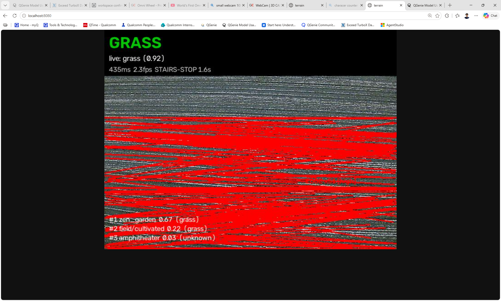

# Lighthouse 🔦 | Qualcomm Multiverse Hackathon Finalist

|  |  |
:-------------------------:|:-------------------------:

**An open-source self-steering white cane powered by on-device AI.**

A 3D-printed omni wheel at the cane tip physically steers the user around
obstacles and along walking routes. All AI runs on Qualcomm silicon — no cloud,
no subscription, no signal required. Built, printed, assembled, and walked with.


**Demo Video**

https://github.com/user-attachments/assets/4f166f12-43d0-46fc-8983-bd9591bafe06

**Snapdragon Multiverse Hackathon 2026** · Qualcomm San Diego

| | |
|---|---|
| **~$196 total** | Excluding the phone. Commercial smart canes: $800–$1,150 |
| **No depth sensor** | Monocular metric depth on the Hexagon NPU replaces a LiDAR unit |
| **Fully offline** | Airplane mode changes nothing about obstacle avoidance |
| **AI across the Qualcomm multiverse** | Phone NPU/GPU + board CPU, running 8 models across 2 Snapdragon SoCs simultaneously |
| **Open source** | Code, CAD, BOM, wiring — AGPL-3.0 |

---

## Team

| Name | Github |
|---|---|
| Rohin Sood | https://github.com/rohinsood |
| Manuel Rodriguez | https://github.com/MaRodriguezB777 |
| Venkata Yaswanth Kanduri | https://github.com/kvyaswanth |
| Noah Zhang | https://github.com/iujab |

---

## Why this exists

250 million people live with impaired vision. A white cane costs $20 and tells
you nothing until you hit something. A guide dog costs $50,000 and has a
multi-year waitlist. Most electronic aids beep or buzz — interpreting that costs
time and attention at the exact moment you have neither.

Lighthouse **steers**. A motorized wheel nudges your hand toward the clear path.
You keep walking. The cane handles the geometry.

The key insight: steering the hand through the cane — grounded kinesthetic
feedback — guides people more accurately and with lower cognitive load than audio
or vibration cues. The NPU is what makes it possible to do the perception for
that steering on a phone, at the cadences required, on a battery.

---

## Accessibility first

- **Degrades to a white cane.** If every electronic system fails, contact sensing
  still works. The familiar form is kept deliberately.
- **Steering, not beeping.** Hearing stays free for traffic and conversation.
- **Offline by default.** No account, no connectivity, no privacy cost.
- **Private by construction.** Camera, audio, and location never leave the device.
- **Power on and walk.** No configuration needed to avoid obstacles.
- **Printable.** No proprietary parts. Break a piece, print another.
- **Refuses rather than guesses.** No corridor found → STOP, not a random direction.

---

## Edge AI on the Qualcomm stack

AI runs on **two Qualcomm SoCs simultaneously** — the phone's Snapdragon 8 Elite
(NPU + GPU) handles high-framerate vision, while the Arduino UNO Q's Dragonwing
QRB2210 (4×A53 CPU) runs a terrain classifier and a depth navigator on a
downward-facing camera at the cane handle. Different models, different devices,
different parts of the problem — all on Qualcomm silicon, all offline.

### Models running across the system

**Phone — Snapdragon 8 Elite (Hexagon NPU + Adreno GPU):**

| Model | What it does | Cadence | Accelerator |
|---|---|---|---|
| **Depth-Anything-V2-Metric-Small** | Per-pixel distance in meters | ~3 Hz | QNN → Adreno GPU / Hexagon NPU |
| **FFNet-78S-LowRes** (Cityscapes) | Walkability segmentation, outdoor | every frame | QNN → Hexagon NPU |
| **SegFormer-B0** (ADE20K) | Walkability segmentation, indoor | every frame | QNN → Hexagon NPU |
| **YOLOv8n** | Object detection + depth-scale calibration | 1 Hz | QNN EP |
| **Qwen3.5-2B** (Q4_0 GGUF) | On-device scene companion | on request | GenieX → Hexagon NPU |
| **Kokoro-82M** | Neural text-to-speech | on utterance | sherpa-onnx, CPU |

**Board — Dragonwing QRB2210 (4×Cortex-A53 @ 2 GHz):**

| Model | What it does | Cadence | Runtime |
|---|---|---|---|
| **Places365 ResNet18** | Terrain classification → 6-class taxonomy | ~2.3 fps | ONNX Runtime, CPU |
| **Depth-Anything-V2-Small** (126×126) | Ground-cam depth navigator | ~2.2 fps | ONNX Runtime, CPU |



*Terrain sensor running on the UNO Q: Places365 classifying the ground surface
(GRASS, 0.92 confidence) at 435 ms / 2.3 fps, with Canny+Hough stair-edge
overlay in red. On a stairs detection, the wheel stops immediately and holds for
3 seconds — regardless of what the phone is asking for.*

### The terrain sensor — board-side AI that overrides the phone

The board's downward camera runs a **Places365 ResNet18** scene classifier
aggregated into a 6-class terrain taxonomy:

| Class | Meaning | Action |
|---|---|---|
| `sidewalk` | Walkable outdoor surface | → phone: OUTDOOR MODE |
| `road` | Vehicular surface | warn — user shouldn't be here |
| `grass` | Natural terrain | → phone: OUTDOOR MODE |
| `stairs` | Staircase / escalator / drop-off | **IMMEDIATE WHEEL STOP + 3 s hold** |
| `indoor_floor` | Interior walking surface | → phone: INDOOR MODE |
| `unknown` | Ambiguous | no action |

The stair-edge detector is a second signal: Canny + probabilistic Hough on the
lower 60% of the frame, looking for ≥5 parallel near-horizontal edges within 30%
of frame height. When it fires alongside the classifier, confidence is HIGH and
the stop is non-negotiable.

This is the one board-side motor command that **overrides the phone's steering
authority**. The phone drives the wheel left/right/clear — but STAIRS STOP takes
priority, because a staircase detected from the ground-facing camera is a
near-immediate hazard that the forward-facing phone may not see until the user is
at the edge.

The terrain label also **automatically switches the phone's nav mode** —
indoor_floor → indoor models (SegFormer + Hypersim depth), sidewalk/grass →
outdoor models (FFNet + VKITTI depth). No manual toggle needed.

### Accelerator allocation

```
QNN config: soc_model=69, htp_arch=79, burst mode, fp16
Fallback:   strict → mixed → CPU (never crashes, always runs)
```

**Vision takes the GPU first.** Not because it's faster — but because the
companion SLM decodes on the Hexagon NPU, and contending for it stalls the
safety-critical steering loop. Giving vision the Adreno GPU and reserving the NPU
for language keeps the critical path deterministic. This only matters when you're
running 6 models concurrently on one SoC.

**Domain-matched segmentation, not an ensemble.** FFNet-78S is trained on
Cityscapes (roads, sidewalks, curbs). SegFormer-B0 is trained on ADE20K (indoor
floors, doors, furniture). Running both every frame and merging was the earlier
design — it averaged away the specialization. Selecting one per nav mode halves
the compute for no measurable loss.

### Measured on-device

| What | Device | Result |
|---|---|---|
| Companion SLM first token (Qwen3.5-2B, Hexagon) | S25 Ultra | **186 ms** |
| Companion SLM decode rate | S25 Ultra | **12.1 tok/s** |
| Terrain classifier (Places365 ResNet18) | UNO Q | **435 ms / 2.3 fps** |
| Depth navigator (DA-V2, 126×126) | UNO Q | **452 ms / 2.2 fps** |
| Depth at higher res (DA-V2, 252×252) | UNO Q | 1728 ms — too slow for steering |
| MiDaS int8 on CPU | UNO Q | 1001 ms — **slower than float** (no NPU = dequant overhead) |

The board rows show why the split exists: the UNO Q runs terrain classification
and near-field depth at viable rates, but the high-res depth needed for corridor
planning at >3 Hz requires the phone's NPU. Each device does what it's good at.

### Qualcomm tooling

| Tool | Role |
|---|---|
| **QNN / QAIRT EP** | All phone vision inference, three-tier fallback |
| **Qualcomm AI Hub** | Sourced FFNet-78S and SegFormer-B0 |
| **GenieX** | On-device LLM runtime (Qwen3.5-2B) |
| **QUAD MCP** | Profiled models on real silicon over ADB |
| **Hexagon NPU** | Seg, depth, SLM decode on the phone |
| **Adreno GPU** | Vision (preferred tier) on the phone |
| **Arduino UNO Q** (Dragonwing QRB2210) | Terrain classification + ground-cam depth + actuation |
| **ONNX Runtime on QRB2210** | Board-side inference (Places365, DA-V2) at ~2.3 fps |
| **Arduino UNO Q** (Dragonwing QRB2210) | Cane board — sensing and actuation |

---

## How it works

```
Galaxy S25 Ultra — Snapdragon 8 Elite
  │
  ├─ Camera ~11 Hz → gravity-upright → 640×640 letterbox
  │    ├─ Depth-Anything-V2  @~3 Hz   metric depth (meters)
  │    ├─ Walkability seg    per-mode  FFNet outdoor / SegFormer indoor
  │    └─ YOLOv8n            @1 Hz    labels + depth-scale cal
  │         │
  │         └─ TraversabilityGrid  61×60 @ 0.1 m  log-odds  self-calibrating ground
  │              │
  │              └─ PolarPlanner  37 sectors ±90°  path-first  hysteresis
  │                   │
  │                   └─ CommandAggregator  200 ms vote → one letter
  │
  ├─ CompassNav  GPS + heading → goal bearing (Google routes or beeline)
  │
  └─ BLE ──► Arduino UNO Q — Dragonwing QRB2210
               ├─ Modulino Motors → omni wheel steers
               ├─ Modulino Distance → near-field STOP
               ├─ Modulino Vibro → haptic alert
               ├─ Ground camera → terrain.py (Places365 ResNet18)
               │    sidewalk/grass → OUTDOOR MODE
               │    indoor_floor → INDOOR MODE
               │    stairs → IMMEDIATE STOP + 3 s hold
               ├─ Ground camera → navigator.py (DA-V2 depth, 7-column)
               └─ 2 s failsafe
```

### Path-first planning

The planner is a **pass-through by default** — the route owns the heading.
Avoidance engages only when a ±10° cone around the goal is blocked.

- **Hysteresis:** blocks at 1.8 m, unblocks at 2.2 m — can't flip frame to frame
- **Committed heading:** `W_PREV = 1.6` > `W_GOAL = 1.0` > `W_WIDTH = 0.8` — the
  biggest weight resists changing its mind, which kills left-right oscillation
- **Asymmetric:** slow to leave the route (0.35), quick to return (0.45)
- **Refuses rather than guesses:** no corridor + no walkable columns → STOP

### Screen-thirds spoken guidance

An independent fallback, parallel to the planner: middle third decides whether
you can proceed, better outer third becomes the latched dodge side, spoken aloud
on each transition. Reuses data the pipeline already computes — no grid, no
planner involved.

---

## Hardware


Built, assembled, and walked with. ~$196 in parts, excluding the phone.

```
UNO Q ──► Modulino Motors ──► Modulino Vibro ──► Modulino Distance
```

| | |
|---|---|
|  | **Print-in-place omni wheel** — 6 rollers captive in the hub. No bearings, no assembly. Based on [this GrabCAD design](https://grabcad.com/library/omni-wheel-print-in-place-1), adapted for the JGA25 shaft. |
|  | **S25 Ultra cradle** — pivoting hinge, rear cameras forward. |
|  | **Anker 737 cradle** — powers the board, charges the phone. |

**CAD source (Onshape):**
[open the live document](https://cad.onshape.com/documents/c0b905e8d1b94a52d9e9ca97/w/f6521fb190a4be4abaa604ca/e/e523a5a009f76747b4bb6591)

Full BOM and assembly: [`Hardware/`](Hardware/)

---

## Getting started

```bash
git clone https://github.com/<your-account>/lighthouse.git
cd lighthouse
git checkout v3
```

```bash
./gradlew :app:testDebugUnitTest     # 10 test classes, no device needed
./gradlew :app:installDebug
```

Models (depth + seg) must be pushed separately — see [`docs/MODELS.md`](docs/MODELS.md).
Board setup: [`docs/BOARD.md`](docs/BOARD.md).
Full from-scratch walkthrough: [`docs/SETUP.md`](docs/SETUP.md).

`main` also carries a merged demo (qhackGPS navigator + camera scan toggle) —
see [`docs/BRANCHES.md`](docs/BRANCHES.md).

---

## Repository layout

| Branch | What |
|---|---|
| **`main`** | Docs + hardware + merged demo app (qhackGPS + camera scan + voice) |
| **`v3`** | Full perception system — seg, depth, BEV grid, polar planner, SLM |
| `qhackfinal`, `qhackgps` | Nav prototypes and their lineage |

---

## Performance

| Parameter | Value |
|---|---|
| Perception cadence | 90 ms (~11 Hz) |
| Depth inference | 300 ms (~3 Hz) |
| Detection | 1000 ms (1 Hz) |
| Motor decisions | 200 ms (5 Hz) |
| Board failsafe | 2 s silence → motor stops |

Instrumented per-frame: `adb logcat -s ShepherdTime`

---

## Safety

**Research prototype. Not a sole mobility aid. Test with a sighted companion.**

| Guard | Threshold |
|---|---|
| Board motor failsafe | 2 s |
| Phone STOP on stalled vision | 600 ms |
| BLE write-stall teardown | 4 s |
| Planner can't find corridor | immediate STOP |

---

## Roadmap

**Done:** metric depth on NPU · domain-matched seg · BEV log-odds grid ·
path-first planner · walking routes + reroute · BLE steering · near-field ToF ·
terrain classification with stair-edge detection · automatic indoor/outdoor mode
switching · ground-cam depth navigator · neural TTS · on-device STT · OCR ·
screen-thirds spoken guidance · 2B companion on Hexagon · full CAD · cane built
and walked with

**Next:** end-to-end latency measurement · battery life characterization ·
companion model thermal gating · moving-obstacle prediction · user evaluation

---

## Prior work and acknowledgments

The steering concept — a motorized omni wheel applying grounded kinesthetic
feedback — is based on:

> P. Slade, A. Tambe, M. J. Kochenderfer, "Multimodal sensing and intuitive
> steering assistance improve navigation and mobility for people with impaired
> vision," *Science Robotics* **6**(59), eabg6594 (2021).
> [doi:10.1126/scirobotics.abg6594](https://doi.org/10.1126/scirobotics.abg6594)

Their study showed +18% walking speed for participants with impaired vision vs. a
white cane. Those are their results for their device — not a claim about ours.
Lighthouse is an independent implementation, not affiliated with the authors or
Stanford.

Also: [GrabCAD print-in-place omni wheel](https://grabcad.com/library/omni-wheel-print-in-place-1) ·
Qualcomm (NPU, QNN, AI Hub, GenieX, QUAD) · Arduino (UNO Q, Modulinos) ·
Depth-Anything-V2, FFNet, SegFormer, ONNX Runtime, sherpa-onnx.

## License

**AGPL-3.0** — see [`LICENSE`](LICENSE). Set by the bundled YOLOv8n detector.
Full reasoning: [`NOTICE.md`](NOTICE.md).

Open hardware, open software. Build it, change it, share it.
